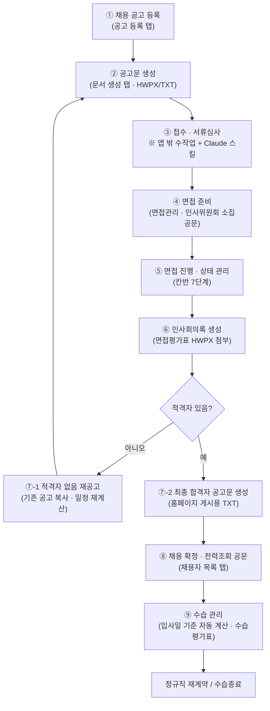

# 채용 달력 관리 웹앱 — 업무 플로우 정리 (as-built)

대상: `kittycong/guro_recruitment-calendar-app` (구로장애인자립생활센터 채용 달력 관리 웹앱)
정리 기준: 2026-09-14 기준 `main` (커밋 `0dcaa63`)의 실제 코드(`outputs/recruitment_calendar_app/index.html`, `app.js` 5,965줄)를 읽고 확인한 **현재 구현 상태**

> 저장소에 이미 있는 `recruitment_probation_workflow.md`는 "앞으로 이렇게 만들자"는 **계획 문서**입니다.
> 이 문서는 "지금 앱으로 실제로 어디까지 되는가"를 정리한 **운영용 플로우 문서**이고,
> 마지막 장에 계획 문서와의 차이(구현/미구현)를 표로 붙였습니다.

---

## 0. 앱 기본 정보

| 항목 | 내용 |
|---|---|
| 배포 주소 | `https://kittycong.github.io/guro_recruitment-calendar-app/` |
| 배포 방식 | `main` push → GitHub Actions(`pages.yml`)가 `outputs/recruitment_calendar_app` 폴더를 그대로 배포 |
| 기술 | 프레임워크 없는 정적 HTML/CSS/JS + `jszip`(HWPX 생성용). 서버·DB 없음 |
| 데이터 저장 | **브라우저 localStorage**. 공고/수습/채용자정보/생성문서함/양식캐시/디자인설정/자동백업 |
| 외부 연동 | ① 임원 캘린더 CalDAV 동기화(매시간, GitHub Actions) ② Google 캘린더 OAuth(면접일정 등록) |
| 화면(탭) | 채용 공고 등록 · 달력 · 면접관리 · 채용목록 · 채용자 목록 · 수습관리 · 문서 생성 · 칸반 · 타임라인 · 디자인 설정 · 설명서 (11개) |

---

## 1. 전체 업무 플로우



한 줄 요약: **공고 등록 → 일정 자동계산 → 한글 공문 생성 → 면접 상태 관리 → 회의록 → 결과 공고 → 전력조회 → 수습평가**까지가 앱 안에서 돌아가고, **이력서 접수·현황표·문자 발송**은 앱 밖에서 처리합니다.

---

## 2. 단계별 상세

### ① 채용 공고 등록 — `채용 공고 등록` 탭

입력 항목: 채용건명 / 부서 / 채용명수 / 붙임1 채용분야(여러 행) / 지원경로 / 공고유형 / 공고일 / 채용유형 / 시행번호(`GR2026-A-###`) / 면접 확정일 / 근무개시일 / 채용일자 / 수습개월 / 최종상태 / 메모 / 면접 대상자 목록

- 부서 선택지: 사무행정팀, 활동지원팀, 복지사업팀, 복지사업팀(주택), 사무국
- 채용건 최종상태: 진행중 / 채용 / 불합격 / 포기 / 보류
- 채용분야를 2행 이상 넣으면 공고문 HWPX의 붙임 표가 분야별로 나뉩니다(분야별 근무개시일도 각각 달력에 표시).
- 입력 중인 내용은 자동으로 임시저장됩니다(브라우저 단위).

**자동 일정 계산 규칙** (`buildSchedule`)

| 일정 | 계산식 | 비고 |
|---|---|---|
| 서류접수 마감 | 공고일 **+15일**(일반) / **+8일**(긴급) | 접수기간에 낀 **평일 공휴일 수만큼 추가 연장**(연장분에 또 공휴일이 걸리면 재보정) |
| 서류마감 수동입력 | 직접 입력값 우선 | 공고일 이후 날짜일 때만 적용 |
| 서류심사일 | 서류마감 **다음날 이후 첫 평일** | 수동 지정 시 그 값 우선 |
| 2차 면접(예정)일 | 서류심사 **다음날 이후 첫 평일**, 단 **임원 캘린더가 바쁜 날은 건너뜀** | 최대 60일까지 탐색 |
| 면접 확정일 | 직접 입력 시 이후 계산의 기준일이 됨 | 임원 일정과 겹치면 경고 표시 |
| 3차 적격여부 확인 | 면접일 다음 첫 평일 ~ 그 다음 첫 평일 | 공고문·미리보기에만 표기(달력 일정은 생성 안 함) |

- 평일 판정에 쓰는 공휴일 표는 `app.js`에 **2026~2027년만 하드코딩**되어 있습니다(2028년부터는 표 추가 필요).
- 임원 캘린더 회피는 **날짜(하루) 단위**입니다. 오전/오후 시간 슬롯 구분은 없습니다.

### ② 공고문 생성 — `문서 생성` 탭

- **채용 공고문 HWPX**: 등록된 공고를 선택하면 시행번호·접수일자·채용분야가 자동으로 채워지고, 내장 양식(`sample_notice`)으로 바로 생성됩니다.
- **메모장용 TXT**: 홈페이지 게시용으로 특수문자를 줄인 텍스트 버전.
- **미리보기**: 생성 전 본문을 팝업으로 확인.
- 생성한 문서는 **생성 문서함**에 자동 기록(최근 30건)되어 다시 내려받을 수 있습니다.

### ③ 접수 · 서류심사 — **앱 밖 구간**

앱에는 이력서 파일 업로드·파싱·입사지원현황표 기능이 **없습니다.** 현재 처리 방법:

1. 사람인·이메일·고용24 등으로 받은 이력서를 공고별 폴더에 모읍니다.
2. 입사지원현황표(엑셀)는 Claude의 **`hiring-status-table` 스킬**로 작성/갱신합니다(이력서 PDF를 읽어 순번·지원일·성명·성별·나이·학력·자격증·장애유무·연락처·주소·심사1·심사2·공고인증번호 채움).
3. 서류심사 결과는 앱의 **면접 대상자** 항목(이름·연락처·상태)에 옮겨 적습니다.

### ④ 면접 준비 — `면접관리` 탭 + `문서 생성` 탭

- 면접관리 탭은 **확정 면접 / 예정 면접**을 나눠서 보여줍니다. 면접 확정일을 저장하면 확정 목록으로 이동합니다.
- **인사위원회 소집공문 HWPX**: 회의 차수·회의일·시간(기본 16:00)·장소·안건·참석대상·시행번호·접수일을 입력해 생성(양식 내장).
- **Google 캘린더 등록**: 상단 `Google 연결` 후 캘린더 ID를 지정하면 면접 일정을 캘린더에 등록합니다. 실패하면 캘린더 등록 링크로 대체되고, **ICS 파일 다운로드**도 가능합니다.
- 면접 안내 문자/메일 발송 기능은 없습니다. 선택일 상세에서 **일정·대상자·연락처 텍스트를 복사**해 외부에서 발송합니다.
- 면접 안내 공지문은 Claude의 **`interview-notice` 스킬**(이름 마스킹·전화 뒤 4자리 규칙 포함)로 작성합니다.

### ⑤ 면접 진행 · 상태 관리 — `칸반` 탭

지원자 상태는 7단계로 관리되고, 칸반에서 카드를 드래그하거나 이전/다음 버튼으로 변경합니다.

```
서류접수 → 서류심사 → 면접대기 → 면접완료 → 적격심사 → 채용
                                                     └→ 불합격
```

- `타임라인` 탭에서 여러 채용건 일정을 시간축으로 비교할 수 있습니다.
- 달력 화면에는 **오늘 해야 할 채용 업무**(오늘자 일정)와 **마감 알림 배너**(7일 이내 서류마감·면접 최대 4건, D-day 표시)가 뜹니다.
- 상단 요약 지표: 전체 / 면접 예정 / 채용 / 수습중 / 종료임박.

### ⑥ 인사회의록 생성 — `문서 생성` 탭

- 대상 공고를 **최대 2건**까지 선택해 회의록 1개로 합칠 수 있습니다.
- 면접자별 **면접평가표 HWPX를 모두 첨부**하면, 평가표가 있는 사람은 **참석**, 없는 사람은 **불참**으로 자동 처리됩니다(평가표 본문에서 평가 의견도 뽑아 씁니다).
- 회의 유형 5종: 직원채용의 건(최종 채용) / 채용자 없음(부적합·미채용) / 채용자 없음(면접 전원 불참) / 채용취소(입사 전·당일) / 혼합(채용 + 일부 재공고).
- **주의**: 회의록 양식 HWPX만 **내장되어 있지 않습니다.** 최초 1회 직접 업로드하면 브라우저에 캐시되어 다음부터 자동 사용됩니다(`최근 사용 양식: …` 안내 표시).

### ⑦ 결과 처리

**⑦-1 적격자 없음 → 재공고**
`문서 생성` 탭의 **적격자 없음 재공고**에서 기존 공고를 고르고 공고유형·접수일자·새 시행번호를 입력하면, 일정이 다시 계산된 새 채용건이 등록되고 메모에 재공고 사유가 자동으로 들어갑니다. 이후 ②번부터 반복합니다.

**⑦-2 최종 합격자 공고문**
공고를 선택하면 상태가 `채용`인 사람을 모아 홈페이지 게시용 공고문 텍스트를 만들고 **클립보드 복사**까지 지원합니다. 합격자가 없으면 자동으로 "적격자 없음" 버전으로 생성됩니다.

### ⑧ 채용 확정 · 전력조회 — `채용자 목록` 탭 + `문서 생성` 탭

- **채용자 목록**은 별도 입력 없이, 각 공고의 면접 대상자 중 상태가 `채용`인 사람을 자동으로 모아 보여줍니다(부서·업무·직위·입사예정일·시행번호 추론 포함).
- **전력조회 발신공문 HWPX**: 대상자를 고르면 성명·생년월일·부서·직위가 채워지고, 수신처·수신자·시행번호·접수일을 확인한 뒤 **수동으로** 생성합니다(양식 내장).
- **전력조회 회신공문 HWPX**: 타 기관이 우리 퇴사자에 대해 조회를 요청했을 때 회신용(요청기관·대상자명·시행번호·접수일, 양식 내장).

### ⑨ 수습 관리 — `수습관리` 탭

수습자를 등록하면(이름·부서·업무·직위·입사일) 아래가 자동 계산됩니다.

| 항목 | 계산식 |
|---|---|
| 수습끝 | 입사일 **+3개월 −1일** |
| 근무평가 작성일 | 수습끝 **−31일** |
| 작성날짜(기본값) | 근무평가 작성일 **+1 평일** |
| 재계약일 | 수습끝 **+1년 −1일** |

- 달력에 **입사일 / 수습평가 작성일 / 수습종료** 3개 일정이 자동 표시됩니다.
- 평점 13개를 입력하면 합계가 자동 계산되고 등급이 매겨집니다: **S 91↑ / A 81↑ / B 71↑ / C 61↑ / D 그 외**.
- 처리유형: 수습종료 및 정규직 재계약 / 수습종료 / 수습종료(퇴사).
- 종합평가 평가내용과 평가자(소속·직위·성명)를 넣어 **수습평가표 HWPX**를 생성합니다(양식 내장).

---

## 3. 산출 문서 한눈에 보기

| 문서 | 생성 위치 | 양식 | 비고 |
|---|---|---|---|
| 채용 공고문 | 문서 생성 | 내장 | HWPX + 메모장용 TXT |
| 재공고(일정) | 문서 생성 | – | 새 채용건으로 등록 후 공고문 재생성 |
| 인사위원회 소집공문 | 문서 생성 | 내장 | HWPX |
| 인사회의록 | 문서 생성 | **업로드 필요(1회)** | 평가표 HWPX 여러 개 첨부, 공고 2건까지 병합 |
| 최종 합격자 공고문 | 문서 생성 | – | 텍스트 + 클립보드 복사 |
| 전력조회 발신공문 | 문서 생성 / 채용자 목록 | 내장 | HWPX |
| 전력조회 회신공문 | 문서 생성 | 내장 | HWPX |
| 수습평가표 | 수습관리 | 내장 | HWPX |
| 채용목록 CSV | 상단 툴바 | – | 12개 컬럼(채용건명~메모) |
| 데이터 백업 JSON | 상단 툴바 | – | 원본 백업 / 백업 불러오기 |

---

## 4. 앱 밖에서 처리해야 하는 일 (수동 구간)

1. 이력서 수집 및 HWP/PDF 정리 → **Claude + 로컬 폴더**
2. 입사지원현황표 엑셀 작성·갱신 → **`hiring-status-table` 스킬**
3. 서류심사 결과를 앱의 면접 대상자 상태로 옮겨 적기 → **수기 입력**
4. 면접 안내 문자/알림톡/메일 발송 → **외부 발송(앱은 복사 텍스트만 제공)**, 공지문은 **`interview-notice` 스킬**
5. 면접평가표 작성(HWPX) → **면접위원이 직접 작성**, 앱에는 회의록 생성 시 첨부
6. 신규입사 인사카드·책상 이름표 → **아직 앱에 기능 없음**

---

## 5. 계획 문서(`recruitment_probation_workflow.md`) 대비 구현 현황

| 계획 단계 | 현재 상태 | 메모 |
|---|---|---|
| 1. 공고등록 및 기안 | ✅ 구현 | 일정 자동계산 + 임원 캘린더 회피까지 |
| 2. 이력서 수집·PDF 변환 | ❌ 미구현 | 앱 밖 수작업 |
| 3. 입사현황표 엑셀 | ❌ 미구현 | 앱에는 채용건 CSV만 있고 지원자 엑셀은 없음 → 스킬로 대체 중 |
| 4. 부서 팀장 서류 검토 | ⚠️ 부분 | 지원자 상태 변경은 가능, 팀장 의견 기록란은 없음(메모로 대체) |
| 5. 면접대상자 분리·인쇄 | ⚠️ 부분 | 목록·상태 관리는 가능, 대상자별 인쇄 세트는 없음 |
| 6. 면접 안내·알림 | ⚠️ 부분 | 복사 텍스트 + Google 캘린더/ICS는 **구현됨**(계획서엔 "불가"로 적혀 있으나 현재 가능). SMS·알림톡·메일은 없음 |
| 7. 면접평가표 작성 | ⚠️ 부분 | 앱은 생성 안 하고 **읽어서 활용**(회의록 자동 반영) |
| 8. 인사회의록 자동생성 | ✅ 구현 | 참석/불참 자동 판정, 회의 유형 5종. 양식만 1회 업로드 필요 |
| 9. 최종 합격/불합격 공고 | ✅ 구현 | 적격자 없음 버전 자동 분기 |
| 10. 재채용 루프 | ✅ 구현 | 적격자 없음 재공고 패널 |
| 11. 전력조회 공문·회보서 | ✅ 구현 | 발신·회신 공문 모두 |
| 11-1. 신규입사 이름표 | ❌ 미구현 | 코드에 관련 기능 없음 |
| 12. 수습 목록·수습평가표 | ⚠️ 부분 | 목록·자동계산·HWPX 생성은 됨. **수습명단 XLSX 다운로드는 없음** |

---

## 6. 운영 시 주의사항

1. **데이터는 그 브라우저에만 있습니다.** 서버 동기화가 없어 PC/브라우저를 바꾸면 데이터가 보이지 않고, 여러 담당자가 같은 데이터를 공유할 수 없습니다. → 작업 후 **`원본 백업`으로 JSON을 내려받아 보관**하고, 새 PC에서는 `백업 불러오기`로 복원하세요. (앱 내부 자동 백업은 최근 20개까지만 유지됩니다.)
2. **공휴일 표가 2026~2027년까지만 들어 있습니다.** 2028년 공고부터는 마감일 자동 연장이 틀어지므로 `app.js`의 `PUBLIC_HOLIDAYS`에 연도를 추가해야 합니다.
3. **임원 캘린더 회피는 날짜 단위**입니다. 오전만 바쁜 날도 통째로 제외되므로, 면접 확정일은 최종적으로 사람이 확인해서 넣는 편이 안전합니다.
4. **인사회의록 양식만 내장되어 있지 않습니다.** 처음 쓰는 브라우저에서는 회의록 양식 HWPX를 한 번 올려야 합니다.
5. **저장소가 public입니다.** 지원자 개인정보(이름·연락처)는 앱을 쓰는 브라우저에만 저장되고 저장소에는 올라가지 않습니다. 임원 캘린더도 제목 없이 "누가 어느 날 바쁨"만 기록합니다. 이 원칙을 깨는 커밋(백업 JSON, 이력서 파일 등)을 올리지 않도록 주의하세요.

---

## 7. 다음에 손대면 효과 큰 순서 (제안)

1. **입사지원현황표를 앱 안으로** — 지원자 CSV 가져오기 + XLSX 내보내기. 지금 가장 손이 많이 가는 구간(③)입니다.
2. **수습명단 XLSX 다운로드** — 이미 데이터는 다 있고 내보내기만 없습니다.
3. **신규입사 이름표 HWPX** — 채용자 목록 데이터로 바로 생성 가능(양식만 준비되면 반나절 작업).
4. **팀장 서류검토 의견란** — 지원자별 의견/심사결과 필드 추가(현재는 메모 한 칸).
5. **공휴일 표 연도 자동 확장 또는 공공 API 연동** — 매년 수동 수정 부담 제거.
6. (중장기) **서버 저장소 도입** — 다중 사용자 공유와 데이터 유실 위험 해소. 현재 구조의 가장 큰 제약입니다.
